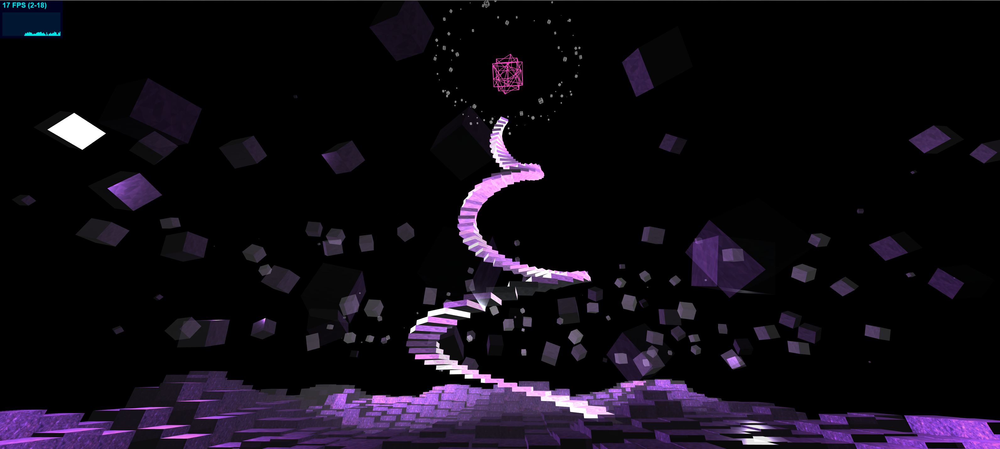
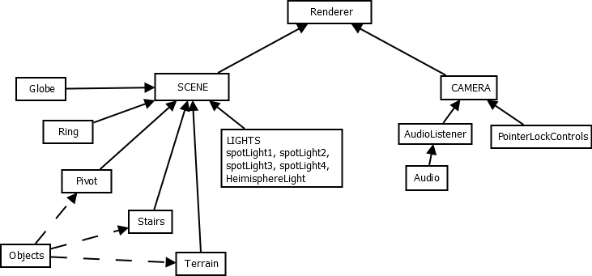
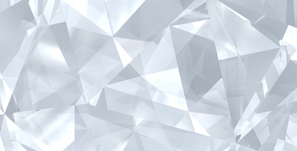
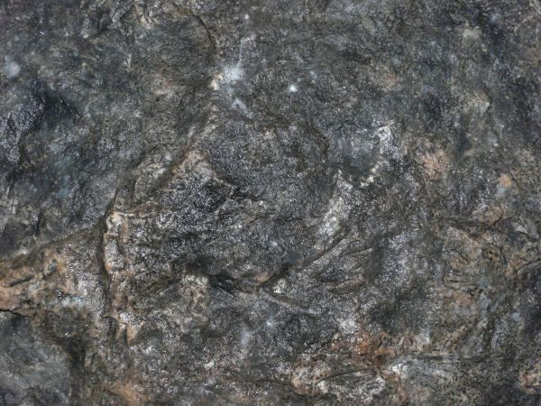
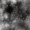

# Modeling and rendering with boxes 

Progetto di Avanzato Thomas e Castellano Astrid

In questo progetto abbiamo voluto ricreare un'ambientazione che avesse un aspetto magico tridimensionale ad effetto "grotta". 

All'inizio l'utente si trova esattamente in centro e per salire sul terreno deve saltare una volta (premendo la barra spaziatrice), invece per spostarsi nella scena basta che utilizzi i comandi: w, a, s e d.

Al centro della scena, come lo si può vedere nell'immagine sottostante, è presente una scala a chicciola imponente con al suo apice un oggetto "Globe" che rende l'idea di un qualcosa di mistico. Nel resto dell'ambientazione ci sono dei cubi trasparenti e riflettenti che ruotano in cerchio attorno ad un punto centrale prefissato.

Abbiamo preferito lavorare sull'effetto scenografico rispetto alla complessita della composizione della scena. Infatti, abbiamo inserito pochi elementi per renderla più pulita e per focalizzare l'attenzione dell'utente sull'atmosfera.

## Pre-requisiti

- Letto attentamente la consegna e le linee guida dettate dal docente.
- Tramite gli opportuni link consigliati, abbiamo appreso come muoverci su GitHub, abbiamo inoltre creato il gruppo per il progetto e clonato la repository.
- Prima di iniziare a programmare, abbiamo raccolto le proposte e pensato che scena ricreare.

## Goals 
In questo progetto è stata creata un'ambientazione fatta di soli cubi, che sono stati traslati, scalati e ruotati.

La consegna prevedeva di aggiungere delle animazioni che son state implementate per far ruotare e spostare i cubi fluttuanti e l'interazione con l'utente tramite i comandi da tastiera e mouse. Di creare, inoltre, un oggetto fatto interamente di cubi con il quale abbiamo ideato una scala a chiocciola con la base più grande ripetto alla cima e scalato in proporzione all'altezza e alla posizione gli scalini.

Un'altro obiettivo da raggiungere è stato quello di disegnare una heightmap in forma di immagine in scala di grigi per lo sviluppo irregolare del terreno della scena.

## Starting code

Per l'implementazione del progetto siamo partiti guardando e analizzando il codice dato dal docente il partenza. 

Abbiamo deciso di utilizzare come schema base iniziale il file "StartingCode-withLights" e poi adattarlo alla nostra scena ideata. 

Per ricreare il terreno, invece, ci siamo basati sul codice "StartingCode-heightmap" che ci ha permesso, tramite l'importazione input dell'immagine da noi creata, di produrre un terreno irregolare di diverse altezze.

## Scene Graph

Dopo aver progettato l'ambiente, l'abbiamo descritto tramite il seguente scene graph.

## Steps 

1. Abbiamo clonato il progetto di partenza della repository "Progetto" del docente.
2. Abbiamo analizzato e compreso i file di codice che ci ha fornito il docente come base di partenza e valutato come appocciarci al problema.
3. Abbiamo aggiunto alla nostra repository il nostro diario "journal.md", nel quale ogni volta in cui sono state apportate modifiche o aggiunte è stato scritto un commento con la relativa data.
4. Prima di iniziare l'implementazione, abbiamo raccolto le idee per l'ambientazione e utilizzato l'[editor](https://threejs.org/editor/) di Three.js per ricrearla andando a modificare le luci e le proprietà dei cubi. Abbiamo fatto delle ricerche, inoltre, per la valutazione della fattibilità su codice già pre-esistente online.
   Ci siamo informati sulle proprietà degli oggetti non viste a lezione come la rifrazione, la riflessione e le simulazioni fisiche dei materiali.
5. Dopo aver scelto quale idea implementare, abbiamo iniziato il lavoro creando n cubi fluttuanti che ruotano attorno ad un perno, detto "pivot". Abbiamo inoltre iniziato ad implementare i materiali da applicare agli oggetti volanti e le luci alla scena e abbiamo aggiunto un effetto "foschia" alla scena tramite la funzione di Three.js "Fog()".
6. Prima dell'implementazione di altri oggetti nella scena, sono state aggiunte le interazioni con l'utente e sono stati testati i comandi. 
   Per l'implementazione del codice, abbiamo cercato e consultato la dispensa della [documentazione online di threejs](<https://threejs.org/docs/index.html#api/en/core/EventDispatcher>).
7. Successivamente abbiamo creato il terreno utilizzando il codice di partenza "StartingCode-heightmap". 
   Abbiamo creato tramite l'utilizzo del programma Photoshop, un immagine (30x30) a scala di grigio in png da passare in input al codice [vedi il sottocapitolo "Terreno"].
   Sono state implementate anche le direttive per il meccanismo di limitazione della mappa, tramite il quale l'utente utilizzando i tasti non può uscire dalla planimetria.
8. In seguito, abbiamo creato un oggetto fatto di cubi. 
   In centro alla scena abbiamo disegnato una scala avviluppata su se stessa composta solo da scalini. 
   Ogni scalino in base alla sua posizione (altezza rispetto alla scena) è scalato proporzionalmente in modo da creare un effetto ottico.
9. In cima alla scala sono stati creati, un cubo fermo in wireframe composto da più cubi ruotati e una serie di piccoli cubi (sempre in wireframe) che ruotano attorno ad esso.
10. Infine, come ultima miglioria è stato implementato il suono per rendere l'atmosfera più misteriosa-magica.

### Materiali

I materiali utilizzati in questo progetto sono:

- [MeshPhysicalMaterial](<http://www.inf.u-szeged.hu/~tanacs/threejs/docs/#api/en/materials/MeshPhysicalMaterial>) utilizzato per gli elementi con cui l'utente può intragire "saltandoci sopra", grazie ad un sisitema di controllo collisione, fornito nell'esempio di [PointerLockControls](https://threejs.org/examples/?q=controls#misc_controls_pointerlock).
  Nota: i controlli delle collisioni vengono effettuati solo per gli oggetti contenuti nell'array "objects".
- [MeshBasicMaterial](<http://www.inf.u-szeged.hu/~tanacs/threejs/docs/#api/en/materials/MeshBasicMaterial>) utilizzato per i cubi in wireframe.

#### Cubi

I materiali per i cubi fluttuanti sono stati implementati nella variabile "boxMaterial". 
Essi sono delle MeshPhysicalMaterial con le seguenti proprietà:

- Colore: 0x0000ff

- Metallo: 0.5

- Rugosità: 0.15

- Trasparente con opacità 0.15

- Riempimento: FrontSide

- Intensità della texture: 5

- PremultipliedAlpha: true

- Texture: 

  

#### Terreno

Il materiale utilizzato per il terreno "groundMaterial" è una MeshPhysicalMaterial con le seguenti proprietà:

- Riflettività: 1

- Colore:  0xbbaaf0

- Metallo: 1

- Rugosità: 0.5 

- Trasparenza con opacità di 0.9

- Riempimento: FrontSide

- Texture:

  

#### Scala

Anche le scale sono dello stesso tipo di materiale dei cubi, ovvero MeshPhysicalMaterial. 
Abbiamo preferito scegliere questo tipo di composizione in modo da poterci salire con l'utente durante la sua interazione.

Le sue proprietà a differenza dei cubi sono:

- Niente trasparenza

- Metallo: 0

- Texture:

  

#### Globo

L'oggetto "Globo" è composto dal materiale MeshBasicMaterial con proprietà:

- colore: 0xff22aa
- wireframe: true

Si tratta di una serie di cubi (tre nel nostro caso specifico) ruotati sugli assi X e Z di un valore casuale. 
La sua posizione è centrale nella scena e si trova all'apice della scalinata, come fosse una reliquia magica conservata nel nostro mondo immaginario.

#### Anello 

E' una sequenza di 32 cubi in wireframe, scalati in maniera casuale e disposti ad anello attorno al globo centrale. Ogni cubo presenta un displacement casuale rispetto alla circonferenza su cui risiedono.

Anch'essi sono formati dal materiale MeshBasicMaterial, come il "Globo", ma con colore pari a 0x666666.

Il senso di questo anello è focalizzare ulteriormente l'attenzione sul "Globo" e aumentare la percezione di mistero.

### Luci

Per il nostro ambiente, abbiamo utilizzato:

- una "[HemisphereLight](<https://threejs.org/docs/index.html#api/en/lights/HemisphereLight>)", chiamata "light" per l'illuminazione posizionata in centro alla scena nelle coordinate (0, 1, 0) con attributi: 

  - 0xeeeeff: colore del cielo
  - 0x777788: colore del terreno
  - 0.1: valore dell'intensità della luce sprigionata

- quattro "[SpotLight](<https://threejs.org/docs/index.html#api/en/lights/SpotLight>)", chiamati "spotLight1, spotLight2, spotLight3, spotLight4" per ricreare un illuminazione emessa come fascio di luce da una singola direzione.
  Hanno tutte e quattro l'intensità pari al valore 2.
  - spotLight1 è posta nella posizione con coordinate (100, 30, -10) e sprigina il colore 0x333333. 
    Ha inoltre la proprietà di emettere le ombre con i relativi settaggi della camera:
    - Aspetto della mapSize con le relative ombre in altezza e larghezza:
      spotLight1.shadow.mapSize.width = 1024;
      spotLight1.shadow.mapSize.height = 1024;
    - Piano di ritaglio vicino alla camera:
      spotLight1.shadow.camera.near = 500;
    - Piano di ritaglio lontano dalla camera: 
      spotLight1.shadow.camera.far = 4000;
    - Settaggio dell'angolo verticale:
      spotLight1.shadow.camera.fov = 30;
  - spotLight2 è posta nelle coordinate (-160, 80, -20) con corrispondenza opposta troviamo spotLight3 con coordinate (160, 80, 20) e infine spotLight4 in coordinate (-160, 80, 20). 
    Queste tre luci emettono la tonalità 0xd966ff.

### Terreno

Per la creazione del terreno è stato utilizzato il codice di partenza dato dal docente "StartingCode-heightmap", in particolar modo il metodo "getHeightData()" al quale vengono passati in input l'immagine heightmap e la scala e ritorna in output un array "data" contenente le altezze.

Per l'immagine heightmap abbiamo creato è un immagine png 30x30 nella scala di grigio. 

Il terreno è stato impostato nel metodo "setGound()", il quale richiama la funzione appena descritta passandogli l'immagine (heightmap.png) e la scalatura (0.1).

Abbiamo implementato il codice per il controllo dei limiti della mappa impostando un'area di bordo da cui l'utente non può uscire. 

### Animazioni

Nel progetto, come richiesto negli obiettivi fondamentali da raggiungere, sono state inserite delle animazioni.

#### Rotazione cubi

Le animazioni sui cubi simulano l'assenza di gravità nell'ambientazione; inoltre l'utente può diverirsi a saltarci sopra, essendo un materiale fisico (MeshPhysicalMaterial).

Tramite la rotazione, si ottengono effetti visivi relativi alla riflessione della luce che viene trasmessa dagli SpotLight inseriti e viene riflessa alterandone le qualità grazie alle textures.

La velocità di rivoluzione e rotazione sono state decise per dare un effetto di rallentamento del tempo.

#### Comandi utente

Sono stati inseriti i comandi da testiera per il controllo della camera: 

- "W" || "UP": avanzamento 
- "A" || "LEFT": traslazione a sinistra
- "D" || "RIGHT": traslazione a destra
- "S" || "DOWN": spostamento all'indietro
- "SPAZIO": salto

Grazie al movimento del mouse, inoltre, è possibile guardarsi attorno (grazie alla rotazione della camera).

I tasti sono rimasti invariati come da codice di partenza reperito nella documentazione di [PointerLockControls](https://threejs.org/examples/?q=controls#misc_controls_pointerlock).

## Problemi riscontrati

Un problema riscontrato e che non siamo riusciti a risolvere è la caduta dell'utente da terreno: quando si muove da un cubo con una certa altezza Y ad un altro con una Y maggiore, la collisione con il terreno non viene catturata e quindi i controlli fanno cadere l'utente sul piano iniziale.
Questo avviene perchè la superficie di collisione è solamente la faccia superiore del cubo e per risolvere il problema bisognerebbe controllare l'urto con tutte le facce dei cubi.

## Aggiunte extra

Come aggiunta finale, si è voluto inserire una traccia audio. 

Per la comprensione dell'utilizzo ci siamo basati sulla documentazione online di three.js sulle tecniche di audio: [AudioLoader](<https://threejs.org/docs/index.html#api/en/loaders/AudioLoader>) e [AudioListener](<https://threejs.org/docs/index.html#api/en/audio/AudioListener>).

E' stato aggiunto un controllo sulla riproduzione dell'audio per interrompere la traccia quando i controlli sono in pausa.

## Supporto

Per l'implementazione del codice, ci siamo appoggiati alla guida della [documentazione di three.js](<https://threejs.org/docs/index.html#manual/en/introduction/Creating-a-scene>); all'[three.js editor](https://threejs.org/editor/) per l'implementazione primitiva degli oggetti come prova e studio di fattibilità; al codice di partenza e suggerimenti dati dal docente e al supporto di internet per il reperimento delle immagini, del suono e delle informazioni su errori o chiarimenti del codice.

