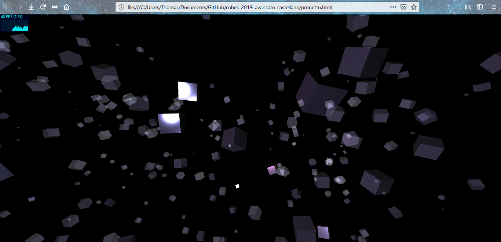
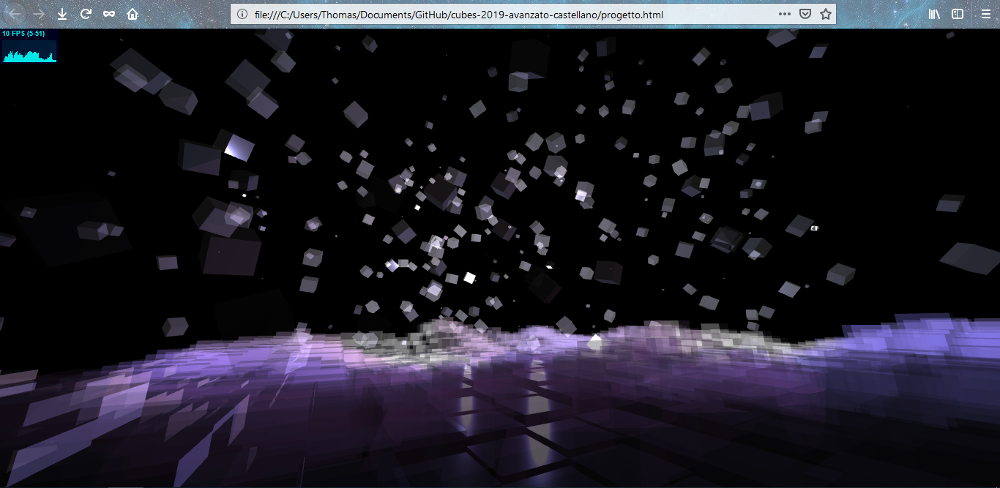
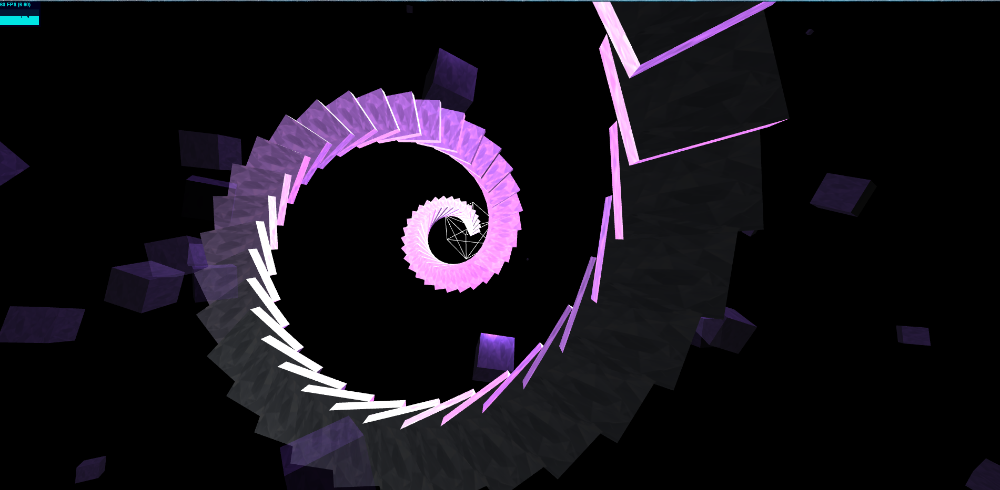
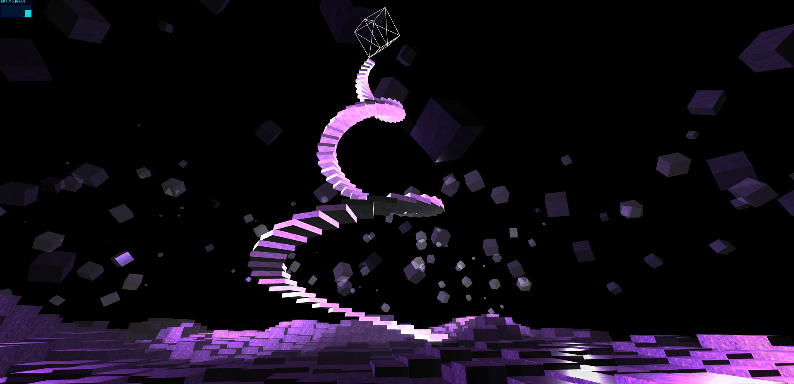

# Diario

## 2019-03-26

- Analisi della traccia e codice di partenza

	- Il primo passo è stato la lettura della traccia del tema, dei suggerimenti e del codice di partenza.
	- Dopo un'attenta lettura e analisi, abbiamo iniziato la fase progettuale.

- Progettazione

	- Scelta e definizione dell'ambientazione.
	- Condivisione di idee.
	- Ricerca di codice pre-esistente on-line per valutare fattibilità e prevedere i tempi di costruzione.
	- Prove con luci e materiali diversi utilizzando l'[editor](https://threejs.org/editor/) di Three.js.

- Implementazione

	- Inizio costruzione del mondo virtuale, ricerca e inserimento dei controlli [PointerLockControls](https://threejs.org/examples/?q=controls#misc_controls_pointerlock).
	- Prove di interazione con inserimento di oggetti di prova (cubi casuali).

## 2019-03-27

- Implementazione e ricerca

	- Generazione di cubi in maniera casuale, fatti poi ruotare attorno ad un nodo pivot genitore.
	- Applicazione del materiale fisico semi trasparente.
	- Aggiunta di luci e controllo dell'effetto di riflessione sui cubi.
	- Prove di interazione tra controllo in prima persona e cubi con materiale fisico (collisioni).

## 2019-03-28

- Implementazione del terreno

	- Creazione di una nuova heightmap 30x30 da utilizzare per il terreno.
	- Creazione della funzione che genera un terreno data una immagine heightmap.
	- Creazione del materiale per il terreno.

## 2019-03-31

- Gestione dei limiti della mappa

	- Creato meccanismo di limitazione, per cui il "giocatore" non può uscire dal terreno virtuale.
	- Ricerca per risoluzione problema con la collisione del terreno (in alcuni casi il giocatore "cade" dal terreno).

## 2019-04-01

- Applicazione di textures al terreno

	- Ricerca ed applicazione di textures per rendere l'effetto "grotta" del nostro mondo virtuale.

## 2019-04-02

- Aggiunte alla scena

	- Creazione degli scalini 
	- Valutazione delle luci nella scena. Per questioni di visulizzazioni ed atmosfera si è optato per utilizzare gli SpotLight al posto dei PointLight (usati in precedenza).

## 2019-04-03

- Messe a punto

	- Modifiche dei colori degli SpotLight e della scala per avere un effetto più soffuso.
	- Modificato la scala per renderla a spirale, ed ogni gradino scalato in base alla sua altezza.

